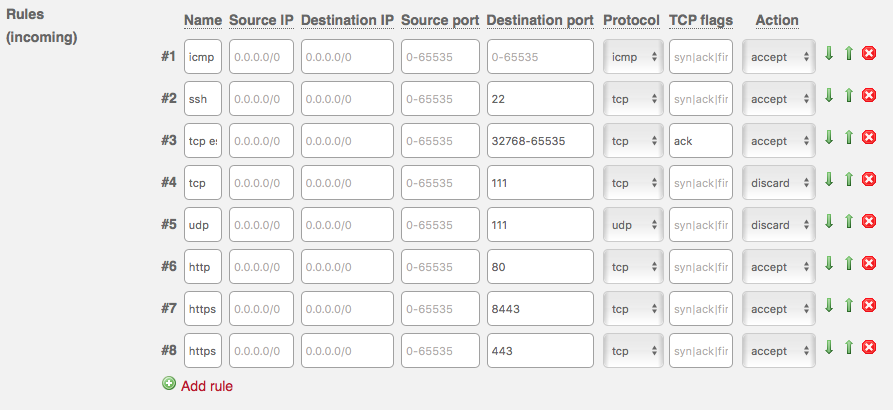

# Disclaimer
This environment has been created for the sole purpose of providing an easy to deployment and consume Red Hat OpenShift Container Platform v3.x environment *as a sandpit*.

This install will create a 'Minimal Viable Setup', which anyone can extend to
their needs and purpose.

Use at your own please and risk!

Openshift Container Platform needs valid Red Hat subscription for Red Hat OpenShift Container Platform! And access to access.redhat.com web site is required to download RHEL 7.x cloud images.

# Contribution
If you want to provide additional feature, please feel free to contribute via
pull requests or any other means.
We are happy to track and discuss ideas, topics and requests via 'Issues'.


# Install Instructions
When following these instructional steps, you will end with a setup similar to


## Installing The Root-Server
NOTE: Our instructions are based on the Root-Server as provided by https://www.hetzner.com/ , please feel free to adapt it to the needs of your prefered hosting provider. We are happy to get pull requests for an updated documentation, which makes consuming this setup easy also for other hosting provider.

When you get your server you get it without OS and it will be booted to rescue mode where you decide how it will be configured.

When you login to machine it will be running Debian based rescure system and welcome screen will be something like this

NOTE: If your system is not in rescue mode anymore, you can activate it from https://robot.your-server.de/server. Select your server and "Rescue" tab. From there select Linux, 64bit and public key if there is one.


This will delete whatever you had on your system earlier and will bring the machine into it's rescue mode.
Please do not your new root password.


After resetting your server, you are ready to connect to your system via ssh.


When you login to your server, the rescue system will display some hardware specifics for you:

```
-------------------------------------------------------------------

  Welcome to the Hetzner Rescue System.

  This Rescue System is based on Debian 8.0 (jessie) with a newer
  kernel. You can install software as in a normal system.

  To install a new operating system from one of our prebuilt
  images, run 'installimage' and follow the instructions.

  More information at http://wiki.hetzner.de

-------------------------------------------------------------------

Hardware data:

   CPU1: Intel(R) Core(TM) i7 CPU 950 @ 3.07GHz (Cores 8)
   Memory:  48300 MB
   Disk /dev/sda: 2000 GB (=> 1863 GiB)
   Disk /dev/sdb: 2000 GB (=> 1863 GiB)
   Total capacity 3726 GiB with 2 Disks

Network data:
   eth0  LINK: yes
         MAC:  6c:62:6d:d7:55:b9
         IP:   46.4.119.94
         IPv6: 2a01:4f8:141:2067::2/64
         RealTek RTL-8169 Gigabit Ethernet driver
```

From these information, the following ones are import to note:
* Number of disks (2 in this case)
* Memory
* Cores

Guest VM setup uses hypervizor vg0 af volume group for guest. So leave as much as possible free space on vg0.

`installimage` tool is used to install CentOS. It takes instructions from a text file.

Create new `config.txt` file
```
vi config.txt
```

Copy below content to that file as an template

```
DRIVE1 /dev/sda
DRIVE2 /dev/sdb
SWRAID 1
SWRAIDLEVEL 1
BOOTLOADER grub
HOSTNAME CentOS-74-64-minimal
PART /boot ext3     512M
PART lvm   vg0       all

LV vg0   root   /       ext4     200G
LV vg0   swap   swap    swap       5G
LV vg0   tmp    /tmp    ext4      10G
LV vg0   home   /home   ext4      40G


IMAGE /root/.oldroot/nfs/install/../images/CentOS-74-64-minimal.tar.gz
```


There are some things that you will probably have to changes
* Do not allocated all vg0 space to `/ swap /tmp` and `/home`.
* If you have a single disk remove line `DRIVE2` and lines `SWRAID*`
* If you have more than two disks add `DRIVE3`...
* If you dont need raid just change `SWRAID` to `0`
* Valid values for `SWRAIDLEVEL` are 0, 1 and 10. 1 means mirrored disks
* Configure LV sizes so that it matches your total disk size. In this example I have 2 x 2Tb disks RAID 1 so total diskspace available is 2Tb (1863 Gb)
* If you like you can add more volume groups and logical volumes.

When you are happy with file content, save and exit the editor via `:wq` and start installation with the following command

```
installimage -a -c config.txt
```

If there are error, you will be informed about then and you need to fix them.
At completion, the final output should be similar to


You are now ready to reboot your system into the newly installed OS.

```
reboot now
```

## Firewall

While server is rebootting you can modify your servers firewall rules sot that OCP traffic can get it. By default firewall allows port 22 for SSH and nothing else. Check below image how firewall setup looks. Firewall settings can be modified under your server's settings in Hetzner's web UI https://robot.your-server.de/server.


You need to add ports 80, 443 and 8443 to the rules and also block 111. If you don't block that port you need to stop and disable `rpcbind.service` and `rpcbind.socket`. Add new rules so that rule listing matches below screenshot.




## Initialize tools

Install ansible and git

```
[root@CentOS-73-64-minimal ~]# yum install -y ansible git wget
```

You are now ready to clone this project to your CentOS system.

```
git clone https://github.com/RedHat-EMEA-SSA-Team/hetzner-ocp.git
```
We are now ready to install `libvirt`as our hypervizor, provision VMs and prepare those for OCP.


## Download RHEL 7.4 cloud image from access.redhat.com

1. Go to RHEL downloads page https://access.redhat.com/downloads/content/69/ver=/rhel---7/7.4/x86_64/product-software
2. Copy download link from image Red Hat Enterprise Linux 7.4 KVM Guest Image to your clipboard

 

Downlaod image
```
wget -O /root/rhel-kvm.qcow2 PASTE_URL_HERE
```

With our hypervizor installed and ready, we can now proceed with the creation of the VMs, which will then host our OpenShift installation.

## Define, provision and prepare guest

Check ```playbook/vars/guests.yml``` and modify it to correspond your environment. By default following VMs are installed:

* bastion
* master01
* infranode01
* node01


Here is a sample of a guest definition
```
guests:
- name: bastion
  cpu: 1
  mem: 1024
  virt_type: kvm
  virt_hypervisor: hvm
  network: bridge=virbr0
  os_type: linux
  os_variant: rhel7.4
  disk_os_size: 40g
  disk_data_size: 200g
- name: master01
  cpu: 1
  mem: 8096
  virt_type: kvm
  virt_hypervisor: hvm
  network: bridge=virbr0
  os_type: linux
  os_variant: rhel7.4
  disk_os_size: 40g
  disk_data_size: 100g
- name: infranode01
  cpu: 1
  mem: 8096
  virt_type: kvm
  virt_hypervisor: hvm
  network: bridge=virbr0
  os_type: linux
  os_variant: rhel7.4
  disk_os_size: 40g
  disk_data_size: 100g
- name: node01
  cpu: 1
  mem: 8096
  virt_type: kvm
  virt_hypervisor: hvm
  network: bridge=virbr0
  os_type: linux
  os_variant: rhel7.4
  disk_os_size: 40g
  disk_data_size: 100g

```

Basically you need to change only num of VMs and/or cpu and mem values. If

Provision VMs and prepare them for OCP. Password for all hosts is `p`.


```
[root@CentOS-73-64-minimal ~]# cd hetzner-ocp
[root@CentOS-73-64-minimal hetzner-ocp]# export ANSIBLE_HOST_KEY_CHECKING=False
[root@CentOS-73-64-minimal hetzner-ocp]# ansible-playbook playbooks/setup.yml
```

Provisioning of the hosts take a while and they are in running state until provisioning and preparations is finnished. Maybe time for another cup of coffee?

When playbook is finished successfully you should have 4 VMs running.

```
[root@CentOS-73-64-minimal hetzner-ocp]# virsh list
 Id    Name                           State
----------------------------------------------------
 34    bastion                        running
 35    master01                       running
 36    infranode01                    running
 37    node01                         running

```


## Install OCP

Installation of OCP is done on bastion host. So you need to ssh to bastion
```
[root@CentOS-73-64-minimal hetzner-ocp]# ssh bastion
```

Installation is done with normal OCP installation playbooks. You can start installation on **bastion** with following command

```
[root@localhost ~]# ansible-playbook /usr/share/ansible/openshift-ansible/playbooks/byo/config.yml
```

When installation is done you can create new admin user and add hostpath persistent storage to registry with post install playbook.

Exit from bastion and execute following on **hypervizor**.

```
[root@CentOS-73-64-minimal hetzner-ocp]# ansible-playbook hetzner-ocp/playbooks/post.yml
```

## Login to Openshift
After successful installation of Openshift, you will be able to login via. Password is the one the you entered during previous playbook (post.yml) execution.

```
URL: https://master.<your hypervisors IP>.xip.io:8443
User: admin
Password: p
```


## Add persistent storage with hostpath or NFS

### Hostpath
Note: For now this works only if you have single node :)
Check how much disk you have left `df -h`, if you have plenty then you can change pv disk size by modifying var named size in `playbooks/hostpath.yml`. You can also increase size of PVs by modifying array values...remember to change both.

To start hostpath setup execute following on **hypervizor**
```
[root@CentOS-73-64-minimal hetzner-ocp]# ansible-playbook playbooks/hostpath.yml
```

### NFS
By default bastion host is setup for NFS servers. To created correct directories and pv objects, execute following playbook on **hypervizor**

```
[root@CentOS-73-64-minimal hetzner-ocp]# ansible-playbook /root/hetzner-ocp/playbooks/nfs.yml
```


## Add new user
Post install tasks create only admin user. If u need to create additional non-admin users, execute following playbook on **hypervizor**

```
[root@CentOS-73-64-minimal hetzner-ocp]# ansible-playbook /root/hetzner-ocp/playbooks/tools/add_user.yml
```

## Clean up everything

Execute following on **hypervizor**

```
[root@CentOS-73-64-minimal hetzner-ocp]# ansible-playbook playbooks/clean.yml
```

## Known issues

### Docker registry fails to resolv

For some reason each host needs to have `search cluster.local` on each nodes /etc/resolv.conf. This entry is set by installer, but resolv.conf if rewritten always on VM restart.

If you need to restart VMs or for some other reason you get this errors message during build.

```
Pushing image docker-registry.default.svc:5000/test/test:latest ...
Registry server Address:
Registry server User Name: serviceaccount
Registry server Email: serviceaccount@example.org
Registry server Password: «non-empty»
error: build error: Failed to push image: Get https://docker-registry.default.svc:5000/v1/_ping: dial tcp: lookup docker-registry.default.svc on 192.168.122.48:53: no such host
```

Then you should run this (on **hypervizor**)

```
[root@CentOS-73-64-minimal hetzner-ocp]# ansible-playbook /root/hetzner-ocp/playbooks/fixes/resolv_fix.yml
```

NOTE: This fix is lost if VM is restarted. To make persistent change, you need to do following on all nodes.

1. ssh to host
2. vi /etc/NetworkManager/dispatcher.d/99-origin-dns.sh
3. Add below line after line 113

```
echo "search cluster.local" >> ${NEW_RESOLV_CONF}
```
Save and exit and then restart NetworkManager with following command

```
systemctl restart NetworkManager
```


### Docker fails to write data to disk

Directory permission and SELinux magic might not be setup correctly during installation. If that happens you will encounter Error 500 during build. If you experience that error, should verify error from docker-registry pod.

You can get logs from docker registry with this command from master01 host

```
[root@CentOS-73-64-minimal hetzner-ocp]# ssh master01
[root@localhost ~]# oc project default
[root@localhost ~]# oc logs dc/docker-registry
```

If you have 'permission denied' on registry logs you need to run following playbook on **hypervizor** and restart registry pod

Playbook for fixing permissions

```
[root@CentOS-73-64-minimal hetzner-ocp]# ansible-playbook /root/hetzner-ocp/playbooks/fixes/registry_hostpath.yml
```

Restart docker-registry pod

```
[root@CentOS-73-64-minimal hetzner-ocp]# ssh master01
[root@localhost ~]# oc delete po -l deploymentconfig=docker-registry
```

### OCP installation fails due access denied

Sometimes OCP installation fails do master access denied problems. In that case you might see error message like following.

```
FAILED - RETRYING: Verify API Server (1 retries left).
fatal: [master01]: FAILED! => {
    "attempts": 120,
    "changed": false,
    "cmd": [
        "curl",
        "--silent",
        "--tlsv1.2",
        "--cacert",
        "/etc/origin/master/ca-bundle.crt",
        "https://master01:8443/healthz/ready"
    ],
    "delta": "0:00:00.050985",
    "end": "2017-08-31 12:39:30.218688",
    "failed": true,
    "rc": 0,
    "start": "2017-08-31 12:39:30.167703"
}

STDOUT:

{
  "kind": "Status",
  "apiVersion": "v1",
  "metadata": {},
  "status": "Failure",
  "message": "User \"system:anonymous\" cannot \"get\" on \"/healthz/ready\"",
  "reason": "Forbidden",
  "details": {},
  "code": 403
}
```

Solution is to uninstall current installation from **bastion** host prepare guests again and reinstall.

Uninstall current installation

```
[root@CentOS-73-64-minimal hetzner-ocp]# ssh bastion
[root@localhost ~]# ansible-playbook /usr/share/ansible/openshift-ansible/playbooks/adhoc/uninstall.yml
```

Prepare guests again

```
[root@CentOS-73-64-minimal ~]# cd hetzner-ocp
[root@CentOS-73-64-minimal hetzner-ocp]# export ANSIBLE_HOST_KEY_CHECKING=False
[root@CentOS-73-64-minimal hetzner-ocp]# ansible-playbook playbooks/setup.yml
```

Start installation again

```
[root@CentOS-73-64-minimal hetzner-ocp]# ssh bastion
ansible-playbook /usr/share/ansible/openshift-ansible/playbooks/byo/config.yml
```

## Customizing guest VMs

By defaults guest VMs are provisioned using defaults. If you need to modify guest options to  better suit your needs, it can be done by modifying `playbooks/vars/guests.yml`

Make modifications and start installtion process. Installer will automatically use file named `guests.yml`. Remember to clean old installation with `ansible-playbook playbooks/clean.yml`
