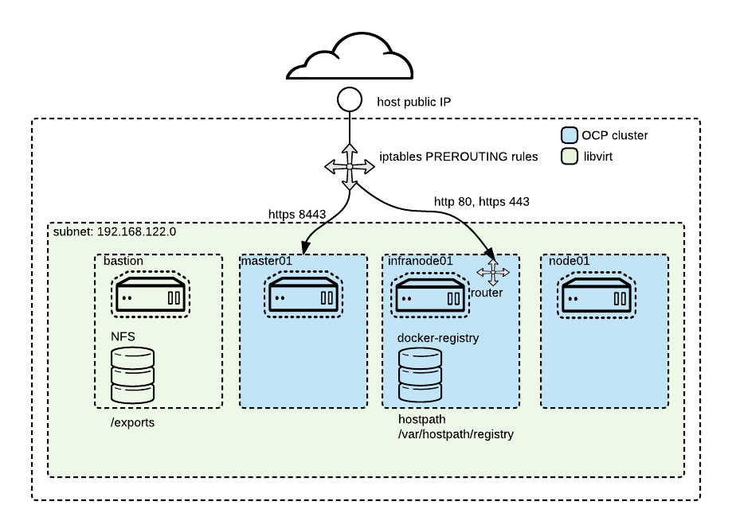

# Set up OCP on libvirt on CentOS 7

## Installing server

When you get your server you get it without OS and it will be booted to rescue mode where you decide how it will be configured.

When you login to machine it will be running Debian based rescure system and welcome screen will be something like this

NOTE: If your system is not in rescue mode anymore, you can activate it from https://robot.your-server.de/server. Select your server and "Rescue" tab. From there select Linux, 64bit and public key if there is one.


This will delete whatever you had on your system earlier and will bring the machine into it's rescue mode.
Please do not your new root password.


After resetting your server, you are ready to connect to your system via ssh.


When you login to your server, the rescue system will display some hardware specifics for you:

```
-------------------------------------------------------------------

  Welcome to the Hetzner Rescue System.

  This Rescue System is based on Debian 8.0 (jessie) with a newer
  kernel. You can install software as in a normal system.

  To install a new operating system from one of our prebuilt
  images, run 'installimage' and follow the instructions.

  More information at http://wiki.hetzner.de

-------------------------------------------------------------------

Hardware data:

   CPU1: Intel(R) Core(TM) i7 CPU 950 @ 3.07GHz (Cores 8)
   Memory:  48300 MB
   Disk /dev/sda: 2000 GB (=> 1863 GiB)
   Disk /dev/sdb: 2000 GB (=> 1863 GiB)
   Total capacity 3726 GiB with 2 Disks

Network data:
   eth0  LINK: yes
         MAC:  6c:62:6d:d7:55:b9
         IP:   46.4.119.94
         IPv6: 2a01:4f8:141:2067::2/64
         RealTek RTL-8169 Gigabit Ethernet driver
```

From these information, the following ones are import to note:
* Number of disks (2 in this case)
* Memory
* Cores

`installimage` tool is used to install CentOS. It takes instructions from a text file.

Create new `config.txt` file
```
vi config.txt
```

Copy below content to that file as an template

```
DRIVE1 /dev/sda
DRIVE2 /dev/sdb
SWRAID 1
SWRAIDLEVEL 1
BOOTLOADER grub
HOSTNAME CentOS-73-64-minimal
PART /boot ext3     512M
PART lvm   vg0       all

LV vg0   root   /       ext4    1800G
LV vg0   swap   swap    swap       5G
LV vg0   tmp    /tmp    ext4      10G
LV vg0   home   /home   ext4      40G


IMAGE /root/.oldroot/nfs/install/../images/CentOS-73-64-minimal.tar.gz
```

There are some things that you will probably have to changes
* If you have a single disk remove line `DRIVE2` and lines `SWRAID*`
* If you have more than two disks add `DRIVE3`...
* If you dont need raid just change `SWRAID` to `0`
* Valid values for `SWRAIDLEVEL` are 0, 1 and 10. 1 means mirrored disks
* Configure LV sizes so that it matches your total disk size. In this example I have 2 x 2Tb disks RAID 1 so total diskspace available is 2Tb (1863 Gb)
* If you like you can add more volume groups and logical volumes.

When you are happy with file content, save and exit the editor via `:wq` and start installation with the following command

```
installimage -a -c config.txt
```

If there are error, you will be informed about then and you need to fix them.
At completion, the final output should be similar to


You are now ready to reboot your system into the newly installed OS.

```
reboot now
```

## Initialize tools

Install ansible and git

```
yum install -y ansible git
```

Create ssh key (no passphrase)

```
ssh-keygen
```

To be able to clone the configs and playbook, you need to add the newly created ssh-key to your account at Gitlab.

Login to gitlab and enter your personal profile


enter the `SSH Keys` tab and copy/paste the content of the newly created file `/root/.ssh/id_rsa.pub`


You are now ready to clone this project to your CenOS system.

```
git clone ssh://git@gitlab.consulting.redhat.com:2222/tigers/hetzner-ocp.git
```
We are now ready to install `libvirt`as our hypervizor.

## Install libvirt and setup environment

```
cd hetzner-ocp
ansible-playbook playbooks/setup.yml
export RHN_USERNAME=yourid@redhat.com
export RHN_PWD=yourpwd
```

With our hypervizor installed and ready, we can now proceed with the creation of the VMs, which will then host our OpenShift installation.

## Provision guest

Check ```vars/guests.yml``` and modify it to correspond your environment. By default following VMs are installed:

* bastion
* master01
* infranode01
* node01




Sample guest definition

```
    - name: bastion
      url: http://hetzner-static.s3-website-eu-west-1.amazonaws.com/rhel73/
      cpu: 1
      mem: 1024
      virt_type: kvm
      virt_hypervisor: hvm
      network: bridge=virbr0
      os:
          type: linux
          variant: rhel7.3
      disks:
          os:
            size: 12
            options: format=qcow2,cache=none,io=native
          data:
            size: 1
            options: format=qcow2,cache=none,io=native
      extra_args: ip=dhcp inst.ks=http://hetzner-static.s3-website-eu-west-1.amazonaws.com/ks/rhel-73-ocp.ks console=tty0 console=ttyS0,115200 quiet systemd.show_status=yes
```

Basically you need to change only num of VMs and/or cpu and mem values.

Provision VMs
```
ansible-playbook playbooks/provision.yml
```

Provisioning of the hosts take a while and they are in running state until installation is finnished. When guest list is empty, all guest are done and ready to be started.

```
virsh list
# installation still running
 Id    Name                           State
----------------------------------------------------
 34    bastion                        running
 35    master01                       running
 36    infranode01                    running
 37    node01                         running
 38    node02                         running
 39    node03                         running

```

NOTE: As long as `virsh list` shows VMs in State `running`, the installation has not ended. To monitor the states of the VMs, you could run `watch virsh list`. It will refresh the command every 2 seconds, until you interrupt this endless-loop with `CTRL-C`.

NOTE: this task can take a long time, don't panic, get a cup of coffee!

If you want to "monitor" the progress, you can view the console of any of the VMs via
```
virsh console master01
```


When the list of running guest VMs is empty, all systems have been installed.

To proceed, you will have to start them again. To do so, enter the command

```
ansible-playbook playbooks/startall.yml
```


Use below commands to copy SSH key to all VMs. Password for all hosts is `p`.

Before executing this playbook, clean all old ssl indentities from file `/root/.ssh/known_hosts` by removing it.

```
export ANSIBLE_HOST_KEY_CHECKING=False
ansible-playbook -i /root/inventory -k playbooks/prepare_ssl.yml
```

## Prepare bastion for OCP installation

Prepare host running below command. Check with `env` command that rhn_password and rhn_username are properly set.

When you have all mentioned above run, be aware this step will again take a long time. Maybe time for another cup of coffee?

```
ansible-playbook -i /root/inventory playbooks/prepare_guests.yml --extra-vars "rhn_username=$RHN_USERNAME rhn_password=$RHN_PWD"
```

## Install OCP

Installation of OCP is done on bastion host. So you need to ssh to bastion
```
ssh bastion
```

Installation is done with normal OCP installation playbooks. You can start installation with following command

```
ansible-playbook /usr/share/ansible/openshift-ansible/playbooks/byo/config.yml
```

When installation is done you can create new admin user and add hostpath persistent storage to registry with post install playbook.

Exit from bastion and execute following on hypervisor.

```
ansible-playbook -i /root/inventory hetzner-ocp/playbooks/post.yml
```

## Add persistent storage with hostpath or NFS

### Hostpath
Note: For now this works only if you have single node :)
Check how much disk you have left `df -h`, if you have plenty then you can change pv disk size by modifying var named size in `playbooks/hostpath.yml`. You can also increase size of PVs by modifying array values...remember to change both.

To start hostpath setup execute following on hypervisor
```
ansible-playbook -i /root/inventory playbooks/hostpath.yml
```

### NFS
By default bastion host is setup for NFS servers. To created correct directories and pv objects, execute following playbook on hypervizor

```
ansible-playbook -i /root/inventory /root/hetzner-ocp/playbooks/nfs.yml
```


## Add new user
Post install tasks create only admin user. If u need to create additional non-admin users, execute following playbook on hypervisor
```
ansible-playbook -i /root/inventory /root/hetzner-ocp/playbooks/tools/add_user.yml
```

## Clean up everything
```
ansible-playbook playbooks/clean.yml
```

## Known issues

### Docker registry fails to resolv

For some reason each host needs to have `search clusterl.local´ on each nodes /etc/resolv.conf. This entry is set by installer, but resolv.conf if rewritten always on VM restart.

If you need to restart VMs or for some other reason you get this errors message during build.

```
Pushing image docker-registry.default.svc:5000/test/test:latest ...
Registry server Address:
Registry server User Name: serviceaccount
Registry server Email: serviceaccount@example.org
Registry server Password: «non-empty»
error: build error: Failed to push image: Get https://docker-registry.default.svc:5000/v1/_ping: dial tcp: lookup docker-registry.default.svc on 192.168.122.48:53: no such host
```

Then you should run this (on hypervizor)

```
ansible-playbook -i /root/inventory /root/hetzner-ocp/playbooks/fixes/resolv_fix.yml
```

### Docker fails to write data to disk

Directory permission and selixus magic might not be setup correctly during installation. Then you will encounter Error 500 during build. If you expience this your should verify error from docker-registry pod.

You can get logs from docker registry with this command from master01 host

```
ssh master01
oc project default
oc logs dc/docker-registry
```

If you have 'permission denied' on registry logs you need to run following playbook on hypervizor and restart registry pod

Playbook for fixing permissions

```
ansible-playbook -i /root/inventory /root/hetzner-ocp/playbooks/fixes/registry_hostpath.yml
```

Restart docker-registry pod

```
ssh master01
oc delete po -l deploymentconfig=docker-registry
```

### OCP installation fails due access denied

Sometimes OCP installation fails do master access denied problems. In that case you might see error message like following.

```
FAILED - RETRYING: Verify API Server (1 retries left).
fatal: [master01]: FAILED! => {
    "attempts": 120,
    "changed": false,
    "cmd": [
        "curl",
        "--silent",
        "--tlsv1.2",
        "--cacert",
        "/etc/origin/master/ca-bundle.crt",
        "https://master01:8443/healthz/ready"
    ],
    "delta": "0:00:00.050985",
    "end": "2017-08-31 12:39:30.218688",
    "failed": true,
    "rc": 0,
    "start": "2017-08-31 12:39:30.167703"
}

STDOUT:

{
  "kind": "Status",
  "apiVersion": "v1",
  "metadata": {},
  "status": "Failure",
  "message": "User \"system:anonymous\" cannot \"get\" on \"/healthz/ready\"",
  "reason": "Forbidden",
  "details": {},
  "code": 403
}```

Solution is to uninstall current installation from bastion host prepare guests again and reinstall.

Uninstall current installation

```
ssh bastion
ansible-playbook /usr/share/ansible/openshift-ansible/playbooks/adhoc/uninstall.yml
```

Prepare guests again

```
export RHN_USERNAME=yourid@redhat.com
export RHN_PWD=yourpwd
ansible-playbook -i /root/inventory playbooks/prepare_guests.yml --extra-vars "rhn_username=$RHN_USERNAME rhn_password=$RHN_PWD"
```

Start installation again
```
ssh bastion
ansible-playbook /usr/share/ansible/openshift-ansible/playbooks/byo/config.yml
```
